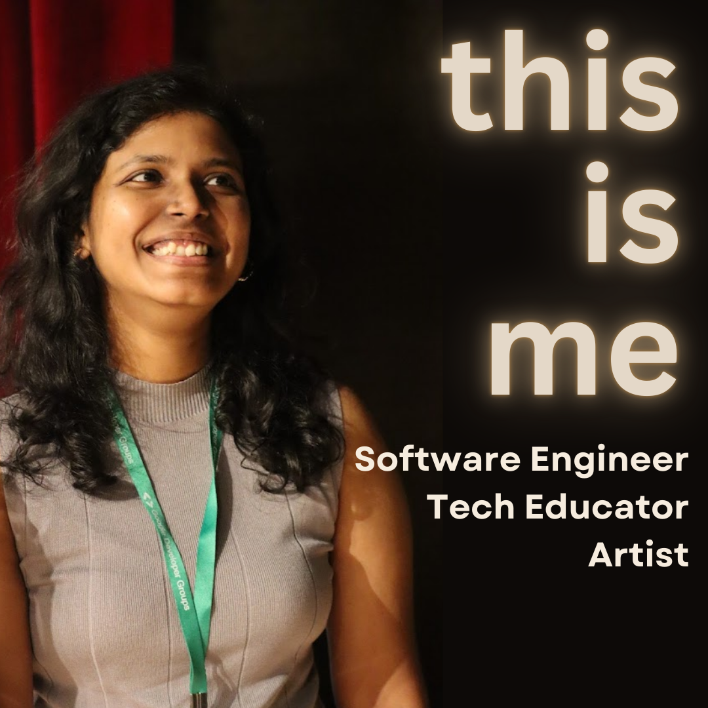

# Hi 👋🏻 I'm Bhavani

I am a **Software Engineer** **specializing in Backend, Data Engineering, and DevOps systems.**&#x20;

[Find out more about me](start-here/about-me.md)

<figure><figcaption></figcaption></figure>

&#x20;&#x20;

## What do you want to learn?

* [Advanced Python Concepts](python/advanced-python/)
* [Apache Airflow Guides](broken-reference/)
* DevOps[ - Docker - Kubernetes - AWS](./#devops)
* [Technical Writing](broken-reference/)
* [Why should you build a side project?](broken-reference/)
* [Goals Burnout, Productivity, Distraction](./#life)
* and a lot more on the sidebar

I know that's a lot. I explore a variety of technical topics and write about them.

Never miss an article. Subscribe to the newsletter below, and I will send it right to your inbox.


