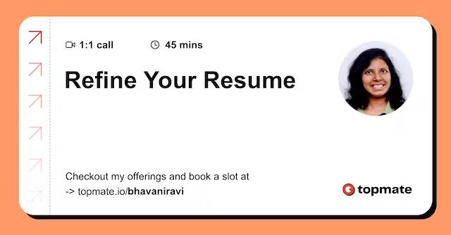

# Refine your Developer Resume

Layoffs are at an all-time high. Hiring is at an all-time low.

Hiring is expected to increase as the new year rolls in, and you can already see it in for the senior roles. It is the perfect time to refine your resume and be ready to apply once the doors open full and wide.

I have been in your shoes, trying different templates, tweaks, and keywords; despite all that, the interview call never came until… I switched to my current resume. There are a few things that I think made it work. The more I shared it with people, the more it made sense to them.

It’s been a week with Topmate, and I have reviewed 6+ resumes. [Based on the resumes I have reviewed](https://topmate.io/bhavaniravi/686949) and my personal experience, I have compiled some of the tips that worked for other people.

<figure><figcaption>
Testimonials on topmate
</figcaption></figure>

### One-Page Only

This might be a no-brainer, but you won’t believe the number of people whose resume overflows one page. But what if you have enough experience and projects to showcase?&#x20;

I hear you. Still, you can fit them all on a page.&#x20;

* Limit your description to the absolute best. Crunch your experience in as few words as possible.
* Two-column layout. Even better, keep one column smaller than the other. Yes, you can stuff so much in such a short page. Miracle.

Here is my resume that finally clicked after so many iterations. The resume that helped me line up interviews back to back

<figure><figcaption></figcaption></figure>

### Skills » About Section

It’s pretty normal to think “About” is the most important section of the resume. How else is the recuriter supposed to know if you fit the role?&#x20;

<figure><figcaption></figcaption></figure>

But, the “About section” is a huge blob of text, pretty hard to read. You can do better. Now, think from the shoes of a recruiter: what are they looking for?

* Your skillset
* Your experience

Hence, the skills section is the most crucial part of a resume. Adding this section to my resume was a game-changer. _**In 2 seconds, this section will communicate what are your key skills and how they match the Job description.**_ This will serve as an anchor to your experience.

Along with the key skills, you can also mention your years of experience if it’s 2+ years.

<figure><figcaption></figcaption></figure>

Common mistakes in this section include

* Overstuffing with too many skills
* Adding irrelevant skills: If you’re applying for backend, drop HTML, CSS
* Drop the basics. If you have ReactJS experience. Drop JS from the list.
* You don’t have to group.&#x20;

### Work Experience

What’s wrong with the following section?

<figure><figcaption></figcaption></figure>

* A resume's job is to highlight "you" and your skill set. Something as simple as swapping the company's name with the Position you held will make a huge difference.

<pre class="language-markdown"><code class="lang-markdown">Lead Developer Advocate(Contract)                      
Dozer - April 2023 - July 2023

- Led initiatives to improve developer onboarding and engagement using Dozer.

- Created sample applications using Dozer and other data engineering tools.
- Developed a detailed content strategy, including podcasts, documentation, and collaborations.
<strong>
</strong></code></pre>

* Highlight the business and the use case. I see so many resumes that don’t have a tint about the project or the product they worked on and jump directly into the tech stack. Setting the context is important and helps people grasp the value of your work.
* Mentioning the project has two advantages for you
  * It will communicate that you are a business-driven developer
  * It will give recruiters an understanding of the kind of work you do.
  * Sometimes, recruiters might have a hard time going through technical jargon. A business problem will make you more relatable.
* Don’t document every little thing you did in this section. Keep each experience section 3-5 points.
  * What is the project?
  * What is your role, contribution, and team?
  * Tech stack, Key outcomes, and metrics

Here is an example from my resume

### Projects Before Education

This can be a no-brainer for many people, but your education should be at the bottom of the resume unless you are from a reputed institution.

The hierarchy of resumes is _**Experience » Projects » and Education**_ in that order.

If you are from a 2nd or 3rd-tier college (an Indian term), mention your university over your college.

### Experience Outside a Job

I see a common misconception, especially with juniors, is that their resume can’t be strong without work experience.

Experience != No of years

Anytime you get out of your comfort zone, it is experience, and **anytime it’s recognized by an external party**. This can be via a freelance gig, an open-source project, or an internship.

<figure><figcaption></figcaption></figure>

### Layout

You don’t need fancy layouts(Unless you’re a designer). Keep it simple

* A recruiter’s brain is already trained enough to look for specific sections; disrupting that with fancy layouts and colors might work against you.
* Don’t add your photo; cognitive biases are real and might work against you. Drop your location if you’re applying for a role that isn’t location-specific.
* Create a good balance of white space and content.

### Using ChatGPT

* ChatGPT is a tool that can work for or against you, depending on your use.
* Don’t expect ChatGPT to write everything for you. Without proper prompting, Chatgpt responses are bland and lifeless.
* What can we do about it?
  * Write out in as much detail about your work experience as possible
  * Use ChatGPT to refine it, make it short, impactful,

### Checklist for you

* Open your resume in PDF Format
* Put yourself in the shoes of the recruiter
* List down 3 things that you notice immediately
* If it’s not your key skills and experience - update and rearrange them
* During the interview, look where the questions are coming from your resume. What draws the most attention?
* Do you want that section to be in the limelight? If not, change things.

Resume writing is an art and an experiment. A good resume will help you find a dream job that's meant just for you.

If you still have trouble getting it right, [schedule a 1:1 session with me](https://topmate.io/bhavaniravi/686949).

<figure><figcaption></figcaption></figure>
