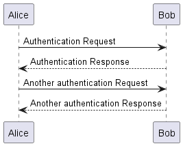

# UML isn't Dead

If you’ve studied software design at the university, there is no chance you missed UML diagrams. But, _“when did you last use UML diagrams?”_ and the answer unanimously came across as _“UML is pretty much dead_, _I used sequence diagrams occasionally, and that’s pretty much it”._ I did some research, and I found some interesting stuff. Buckle up and hold on as we go through this ride.

### How did it start?

It all started when I had to generate class diagrams for a data ingestion engine(2020) I was working on. I quickly found a [Python library](https://www.bhavaniravi.com/python/generate-uml-diagrams-from-python-code) and stitched it to our Pre-Commit, generating a new diagram per commit.

Later in 2022, when I wanted to write a Github action, I used the same blog post as a reference and the generated ERD images as a part of the code review comment.

Are there other tools in the same arena? Is it possible to generate full fletched diagrams just by using codebase as your source of truth? Are there tools like this available already

[Like Simon Brown, I hate diagramming tools. Too much mouse involvement, never up to date](https://dev.to/simonbrown/visio-draw-io-lucidchart-gliffy-etc-not-recommended-for-software-architecture-diagrams-4bmm)

UML diagrams are no longer used for system design. I’m not sure how people are designing systems these days. The code is extremely user-friendly, it’s easier to visualize things from the code base, or is it so?

A quick search on jobs from indeed and LinkedIn shows that the UML skills have been taken out of the Software Engineers’ plate and moved to Solution Architect and Business Analyst’s bucket.

_What does this shift mean?_

As systems become complex, you need a tool that can express the software specifics in an understandable format to both tech and non-tech stakeholders. This makes UML perfect for Veteran Softwarians and enterprise architects who stick with UML. It's a great fit, from brainstorming your system design to developing and documenting them. There are tools in place to help us.

## Software Modeling Diagrams

### UML

UML is widely used in software engineering and recognized as a de facto standard for modeling software systems. It is often used in the early stages of software development to help stakeholders understand and communicate the design of a system. UML is used in various contexts, including business process modeling, enterprise architecture, and system engineering.

### UML Diagram Types

#### Structure Diagrams

* **Class Diagram.**
* Component Diagram.
* Deployment Diagram.
* Object Diagram.
* Package Diagram.
* Profile Diagram.
* Composite Structure Diagram.

#### Behavioral Diagrams

* Use Case Diagram.
* Activity Diagram.
* State Machine Diagram.
* **Sequence Diagram.**
* Communication Diagram.
* Interaction Overview Diagram.

Among these, the class and the sequence diagram are the most commonly used

### ERD Diagrams

ERD diagrams are used to model the logical structure of a database. They depict the relationships between entities (e.g., tables or views) in a database and the attributes that define them. ERD diagrams are used to design and document a database's structure, typically used in the early stages of database development.

### C4 Model

The C4 model is a software architecture model used to describe and communicate the structure of a software system. Simon Brown developed it to improve the effectiveness of software architecture documentation.

The C4 model is based on four levels of abstraction: context, container, component, and code. Each level represents a different perspective on the system, and the model provides a way to visualize and communicate the relationships between these levels.

One key difference between the C4 model and UML is that the C4 model is specifically focused on software architecture. At the same time, UML is a broader modeling language used to design various systems.

### Diagram From Code

As the exploration began at the start of the blog, the goal was to generate a diagram from source code. Below are some language-wise tools that create diagrams.

### PlantUML

**PlantUML** is an open-source tool allowing users to create diagrams from a plain text language. Besides various UML diagrams, PlantUML supports various software development-related formats&#x20;

```
@startuml

Alice -> Bob: Authentication Request
Bob --> Alice: Authentication Response
Alice -> Bob: Another authentication Request
Alice <-- Bob: Another authentication Response

@enduml
```



### ZenUML

ZenUML is a tool similar to plantUML. It claims to have better DSL syntax than PlantUML. PlantUML still has the market because of the ecosystem and the support for all UML diagrams.


### Diagramming Tools

These tools have a structure that will let you write these diagrams in text format. We are skipping the general-purpose diagramming tools such as Draw.io.

#### [WeSsequence Diagrams](https://www.websequencediagrams.com/)

Websequence Diagrams is a simple and easy-to-use online tool. It comes with an online editor with many pre-defined examples to customize. It supports PlantUML syntax.

#### [DBDocs.io](https://dbdiagram.io/home)

DBDocs uses the DBDigram.io tool is specifically designed to generate ERD diagrams based on the DB schema. Similar to the websequence diagram, it has a code-based editor. They support up to 10 diagrams for free.

Dbdiagram.io uses DBML as our syntax for defining databases. [DBML](https://github.com/holistics/dbml) has open-sourced markup language used to describe database schema structure. The team behind DBdiagram also develops DBML.

#### [TryEraser](https://docs.tryeraser.com/docs/examples-1)

Eraser is a beautiful visual + code-based tool that lets you document your cloud architecture and ERD.

#### [Aivosto](https://www.aivosto.com/visustin.html)

* Supports 49 languages [https://www.aivosto.com/visustin.html](https://www.aivosto.com/visustin.html)

#### [Draw.io](https://draw.io)

Draw.io might look like a drag-and-drop UI on the surface. But here is something that most people don’t know about it. It supports plantUML. You import a diagram using plantUML.

<figure><figcaption></figcaption></figure>

Apart from that, it also has ways to import and generate images from SQL or [CSV](https://drawio-app.com/automatically-create-draw-io-diagrams-from-csv-files/).

### Language-Specific Tools and Libraries

In the upcoming sections, we will be discussing language-specific diagram generators. Before we do that, It is important to pause here for a minute and appreciate the greatness of the GraphViz library. This library is the base for some of the famous visualization projects and is pretty much used in all the libraries we are going to discuss in the next section.

### GraphViz

Graphviz is open-source graph visualization software. Graph visualization is a way of representing structural information as diagrams of abstract graphs and networks. The source of major diagramming tools, all the above tools work on top of this.

One downside of GraphViz is heavy(700MB). If you use any of the libraries in CI/CD, you are spinning up a 700MB+ container every time. Not very resource friendly

### [NodeJS Prisma](https://github.com/keonik/prisma-erd-generator)

Prisma is an open-source data access layer that connects databases and manipulates data. It is built on the Node.js runtime and provides a simple and expressive API for working with databases.

### [TypeScript](https://github.com/joaompneves/tsviz)

This simple tool creates a UML diagram from typescript modules. It also uses the famous GraphVis.

### [Ruby On Rails](https://github.com/voormedia/rails-erd)

Rails ERD was explicitly created for Rails and works on versions 3.0-5.0. It uses Active Record's built-in reflection capabilities to determine how your models are associated.

### Python

Python open-source tools are plenty, and since I am a Pythonista, I give more attention to this section

[**Diagrams**](https://diagrams.mingrammer.com/)

A pythonic interface to generate cloud architecture diagrams


```python
# diagram.py
from diagrams import Diagram
from diagrams.aws.compute import EC2
from diagrams.aws.database import RDS
from diagrams.aws.network import ELB

with Diagram("Web Service", show=False):
    ELB("lb") >> EC2("web") >> RDS("userdb")
```

[**Erdantic**](https://github.com/drivendataorg/erdantic)

Erdantic is a simple tool for drawing entity relationship diagrams (ERDs) for Python data model classes. Diagrams are rendered using the venerable Graphviz library. Supported data modeling frameworks are: Pydantic and dataclasses

[**Py2UML**](https://github.com/lucsorel/py2puml)

py2puml produces a class diagram PlantUML script representing class properties (static and instance attributes) and their relations (composition and inheritance relationships).

py2puml internally uses python’s standard inspect library and abstract tree parsing to retrieve relevant information.

**Py**[**FlowChart**](https://github.com/cdfmlr/pyflowchart)

PyFlowchart is a package to:

* write flowcharts in the Python language,
* translate Python source codes into flowcharts.

PyFlowchart produces flowcharts in flowchart.js flowchart DSL, a widely used flowchart textual representation. It's easy to convert these flowcharts' text into a picture via flowchart.js.org diagrams or some markdown editors.

#### Django

Django-extensions, an Opensource project, provides various tools and extensions to make Django development smooth and effortless.

A part of it is [Django Graph models](https://django-extensions.readthedocs.io/en/latest/graph\_models.html) that generate UMLs based on your schema definition.

One downside is that it d[oesn’t support Many2ManyFields](https://github.com/django-extensions/django-extensions/issues/1674), which is still a challenging problem in most of these packages.

**SQLAlchemy**

ERAlchemy is a similar version available for SQLAlchemy-based ORMs. The [original](https://github.com/Alexis-benoist/eralchemy) repo had no updates after 2021, so it was adopted to [eralchemy2](https://github.com/maurerle/eralchemy2). With the release of SQLAlchemy 2.0, I don’t know how much of an impact it will have on ERAlchemy.

### Diagrams on IDEs

#### IntelliJ

Intellij Ultimate(Paid) shows us a dependency diagram (UML) for a package, making it easy to read a new codebase.

Right-click a package, and you'll see diagrams -> Show diagrams.

#### VSCode

Sorry, VSCode people, I haven’t found anything as promising as IntelliJ ones. There are extensions, but they’re not comparable to what IntelliJ can do.

### Behind the scenes

* I ideated, researched, and wrote this blog in December
* If you want to initiate a conversation or want me to write a blog for me, write an email to me [bhavanicodes@gmail.com](bhavanicodes@gmail.com)
