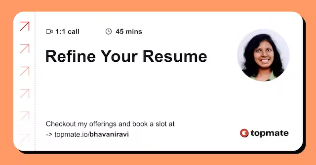

# Why Gitbook?

> This post is a work in progress, I'm still editing it. If you find any mistakes bear with me for now

I have changed this website quite a lot in the last 3 years. It moved from WordPress -> Medium -> Gatsby -> Gitbook -> (??) This post will explain why I moved and what I like about Gitbook.

> The site you are reading on currently is hosted via Gitbook.

Before I answer, why Gitbook? You need to have the context of what all I have tried before landing here&#x20;

### Why So Much Change?

tl;dr Well, as I evolved, I wanted a site that grew with me. Some platforms were too restrictive. Others were just too... you know...&#x20;

Nope let me tell you exactly why

### WordPress

When my mentor asked me to set up a blog online, my immediate choice was WordPress. Whenever I choose a technology, it's because&#x20;

1. It gets the job done well
2. It has enough support online
3. Ease of use

WordPress had all 3. It had great themes and a large community to seek help. SEO support with YoastSEO plugin variety of themes, and it survived for two years.

### 2017

This was my 1st ever website under my domain name. WordPress was easy to start and add more content.&#x20;

<figure><figcaption></figcaption></figure>

#### 2018

As you can see, between 2017 and 2018, the content didn't change much, but the theme did. At this point, I was trying to get a landing page done, but I couldn't make peace with any of them.

The landing page-specific themes didn't have a good blog layout, and vice versa.&#x20;

<figure><figcaption></figcaption></figure>

### Medium&#x20;

#### 2019

Around the same time, I took up #100DaysOfBlogging Challenge with my colleagues, who introduced me to medium. Medium's writing interface is still one of the best ones to write on. That itself was good enough to keep me at medium. Even now, there are like 50+ blogs available on Medium, which I haven't ported here.

#### PayWall

Things started looking bad when Medium added a paywall. It became an awful place to read things. Every blog you open is behind a paywall. I, for one, support all creators being paid. But then, Medium's interface could have been designed better for unpaid users.&#x20;

#### SEO

Another alarming thing was that I wasn't writing under my domain name, which means I'm not building credibility for my domain name. SEO experts suggest that writing your domain name has a lot of benefits in the long run. It's true, and I reap them now.

### Gatsby

#### 2019-2021

Until now, I haven't considered static site generators because I knew I could not stop tweaking them. But by the end of the Medium era, I was sure that was the only option. There was also a need at work to learn ReactJS. I thought, why not put both together? It took me about 3 months to build the site Gatsby and host it on Netlify.

<figure><figcaption></figcaption></figure>

It had a nice landing page; it had a blog page that looked exactly like Medium, which I took a tonne of time to build. All the content was in markdown. So I wrote them on either VSCode or Hackmd.io.

<figure><figcaption></figcaption></figure>

By 2021, I started launching courses, ebooks, and products. This was also the time I started consulting, quitting my full-time job. For every product/service I added to the website, I had to change the code and add new pages, which took a toll on me.

### Gitbook(2022)

#### Layout of Content

It all started when I saw [Bhupesh's TIL](https://til.bhupesh.me/), which was exactly what I needed then. Blogging in chronological order didn't make sense anymore. I was writing things about a variety of topics. The landing page no longer made sense. I figured it could be achieved with Gitbook, with pages and well-written text.

#### Free-Hosting

At this point, netlify was removing free hosting for private repos, and I wasn't confident enough to share my React codebase with the world. Gitbook provides free hosting for up to 5 sites.

#### Write -> Edit -> Publish Loop

Unlike Gatsby, in which writing was a bit of a pain. I didn't like Netlify CMS. The grammar checking was awful when I wrote in VSCode. I was looking was something where the writing experience was close to Medium. A place where I can write, edit and publish with ease not thinking about customizing or formatting

#### Custom Domain

This was a bit of a problem. Gitbook does support custom domains but not base domains. It has to be `*.bhavaniravi.com` but there was a way to work around it. `www.bhavaniravi.com` and rerouting `https://bhavaniravi.com` to the subdomain

#### HTTPS

They enable HTTPS to your site, one more thing you don't have to worry about

#### GitHub support

Gitbook stores all your entries as markdown files in a Git repo in GitHub or Gitlab. If, years down the line, you choose to migrate to a different platform, you don't have to wait around HTTPhem to send you a dump.&#x20;

#### Google Analytics

The Google Analytics integration was super smooth. Create a GA4 dashboard, add the ID, and you're set.

#### Search

Gitbook provides built-in full-text search for your blogs. Building this in Gatsby would be me writing code to integrate Algolia.

### Are there any Downsides?

#### MailChimp Integration

They recently launched it. It's not to the taste of my use. E.g., I can't add it at the end of every page. I have to add it to every page via UI manually. For someone with 150+ pages, that is overkill.

#### No RSS

Since Gitbook is a documentation site, they don't have an RSS feed generated for you. Bhupesh has worked around it by [generating a feed from Github. I'm yet to try this](https://til.bhupesh.me/shell/generate-feed-files-in-git-repo).

#### Slow Page loads

From a recent Google lighthouse run, I found that some pages take about 2.5 seconds for 1st contentful paint. Google hates slow pages, which might affect SEO. This is a killer, but for everything else that Gitbook provides, I decided to wait it out.

> I have reported all this to Gitbook team and they were kind enough to forward it to their product team. I'm hoping to see them added soon

